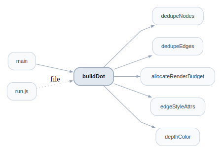
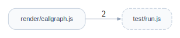

# Technical Reference: Codeshot

## Architecture

Codeshot is a single-file CLI (`render/callgraph.js`) with no server, no persistent state, and no dependencies beyond two external binaries it shells out to.

```
argv (symbol, --path, --out, --limit, --max-render, --format, --depth)
        |
        v
requireOnPath('codegraph')  --- exits with an install hint if missing
requireOnPath('dot')        --- exits with an install hint if missing
formatMismatchWarning(outFile, format) --- warns on stderr if --out's extension disagrees with --format
        |
        v
resolveSymbol(symbol, repoPath) --- runCodegraph(['query', symbol, '--limit', '1', '--json'])
  --- resolves a fuzzy/partial query (e.g. "New") to codegraph's canonical
      name (e.g. "NewOracle") via query's stable JSON contract, used as BOTH
      the rendered root label and the exact name passed to callers/callees
      below; an empty [] result is a clean "not found" exit before any
      further codegraph calls happen
        |
        v
runCodegraph(['callers', resolvedSymbol, '--path', repoPath, '--limit', limit, '--json'])
runCodegraph(['callees', resolvedSymbol, '--path', repoPath, '--limit', limit, '--json'])
  --- parseCodegraphOutput ALSO detects codegraph's plain-text "Symbol not
      found" response (via matchSymbolNotFound) as a defense-in-depth fallback,
      though resolveSymbol above should already have caught a missing symbol
        |
        v
truncationWarning(...)    --- warns on stderr if a result hit --limit exactly (fetch cap)
allocateRenderBudget(...) --- splits --max-render as ONE shared allowance across
                              callers/callees/transitiveEdges (priority order),
                              then renderTruncationNote(...) warns per dimension
                              using its actual allotment, not the raw --max-render
        |
        v
if --depth > 1: collectTransitive('callers', ...) / collectTransitive('callees', ...)
  --- recursively calls codegraph callers/callees on each newly discovered node,
      sequentially, up to --depth hops or a fixed node budget, producing extra
      { from, to, depth } edges; depthBudgetWarning(...) warns on stderr if the
      budget was hit before --depth was satisfied
        |
        v
buildDot(resolvedSymbol, callers, callees, { maxRender, transitiveEdges })  --- pure function, produces a DOT string
        |
        v
renderDotToFile(dot, format, outFile) --- write DOT to a tempfile, `dot -T<format>
                                           <tempfile> -o <outFile>`, delete tempfile
                                           (shared with --architecture mode below)
        |
        v
print outFile path to stdout
```

**`--architecture` mode** is a separate pipeline through the same `main()`, dispatched on the boolean flag before the symbol-trail path runs:

```
argv (--architecture, --path, --out, --limit, --max-render, --max-symbols, --format)
        |
        v
reject if a <symbol> positional was also given, or --depth was explicitly set
        |
        v
enumerateSymbols(repoPath, maxSymbols) --- runCodegraph(['query', '--path', repoPath,
                                            '--json', '--limit', '100000', '--', ''])
  --- an empty-string query WITHOUT --limit silently caps around 50 results
      regardless of repo size; passing a large --limit instead makes codegraph
      return everything it has (see External Dependencies) --- the real cap is
      applied client-side via filterCallableSymbols + a slice to maxSymbols
        |
        v
symbolBudgetWarning(...)  --- warns on stderr if enumeration was capped by --max-symbols
duplicateNameWarning(...) --- warns on stderr if any probed name exists in >1 file
        |
        v
probeFileEdges(symbols, repoPath, limit)
  --- sequential (same concurrency reason as the symbol-mode calls below):
      runCodegraph(['callees', ..., symbol.name], { fatal: false }) per symbol;
      fatal:false + a null check is what lets one bad/ambiguous name skip past
      without aborting the whole multi-minute scan (a bare try/catch around
      runCodegraph does NOT catch this — parseCodegraphOutput calls
      process.exit(1) on a "not found" response, not a thrown Error);
      a stderr progress line every 25 symbols
        |
        v
aggregateFileEdges(symbolEdges) --- dedupes/sums {fromFile,toFile} pairs into
                                     weighted {from,to,weight} file edges;
                                     drops self-file edges and edges missing
                                     a real filePath on either end
        |
        v
renderTruncationNote('files', totalFiles, maxRender) --- warns on stderr if
                                                          --max-render will cut files
        |
        v
buildArchitectureDot(fileEdges, { maxRender })  --- pure function, produces a DOT string
                                                     (topFilesByWeight applies the cap)
        |
        v
renderDotToFile(dot, format, outFile)  --- shared with symbol mode, see below
```

See [README.md](README.md#design-decisions)'s "Design decisions" section for why this shells out to the CodeGraph CLI instead of reading its SQLite index, and why graphviz instead of a JS graph-drawing library.

### Example: Codeshot, drawn by Codeshot

The diagram below is not hand-drawn — it was produced by running Codeshot on its own CodeGraph index (`codeshot buildDot --path . --format svg --out docs/buildDot-callgraph.svg`) and committed verbatim. It draws the call trail of `buildDot`, the pure heart of the tool:



It doubles as a live legend for the [Visual Encoding](#visual-encoding) rules below. `main` calls `buildDot` at a real call site, so that edge is a solid indigo arrow. `test/run.js` only does `require('./render/callgraph.js')` — a module-level import, not a function-level call — so CodeGraph reports it as `"kind":"file"` and Codeshot draws it dotted/gray, labeled `file`, rather than pretending it's a confirmed call. (That file-kind styling wins even though `run.js` is a test file, which would otherwise be dashed — the precedence rule described in [Visual Encoding](#visual-encoding).) On the right, the five callees are the pure helpers `buildDot` composes to turn caller/callee arrays into a DOT string. Regenerate it any time with the command above.

**Why is `buildDot` exported from a file that also runs as a CLI?**
`render/callgraph.js` guards its `main()` call with `if (require.main === module)`, so `node render/callgraph.js <symbol>` still runs the CLI, but `require('./render/callgraph.js')` (used by `test/run.js`) gets `{ buildDot, isTestRef }` without executing anything. This keeps the test suite dependency-free — no test framework, no mocking of `execFileSync`.

## File Descriptions

- **`render/callgraph.js`** — the entire tool. Exports `buildDot(symbol, callers, callees, { maxRender, transitiveEdges })` (pure: turns caller/callee arrays into a DOT digraph string, deduplicating entries with the same `name`+`filePath` so repeated JSON rows don't render as duplicate edges; via `nodeIdentities` it gives each drawn node a graphviz id unique per `name`+`filePath`, so two *distinct* symbols that share a name but live in different files render as two separate boxes instead of silently collapsing into one — graphviz keys a node by the exact string in its edge, so without this the second same-named caller/callee vanishes from the picture; a name that occurs in only one file keeps name-as-id, leaving collision-free graphs byte-for-byte identical to before this existed, and only a colliding name gains a file-qualified id plus a `name\n(basename)` label to tell the boxes apart; when `tooltips` is set (`main` sets it for `svg`/`svgz` output only, since graphviz renders node tooltips as `<a xlink:title>` there and ignores them for raster formats), every drawn node is declared with its `filePath` as a hover tooltip so you can read which file a symbol lives in without cluttering the box — the root symbol is left un-tooltipped since `buildDot` isn't passed its file; if `maxRender` is given, `allocateRenderBudget` splits it as one shared allowance across callers, callees, and `transitiveEdges` — spent in that priority order, so the direct trail is never starved to make room for deeper hops; a `"kind":"file"` node — codegraph's way of saying "this is a module-level/import reference, not a verified function call" — is styled dotted/gray/`"file"` via `edgeStyleAttrs` instead of looking like a real call edge; `transitiveEdges`, an optional array of `{ from, to, depth }` pairs from `--depth > 1` traversal, is colored by `depthColor(depth)` unless it's file-kind — omitting `transitiveEdges`/`maxRender` renders exactly as before either feature existed), `allocateRenderBudget(maxRender, counts)` (pure: the shared-budget split described above, also called from `main` so its stderr notes report what actually got drawn), `dedupeNodes(nodes)` (pure: collapses same-`name`+`filePath` entries, used by both `buildDot` and `main` so distinct-count logic has one source of truth), `dedupeEdges(edges)` (pure: the same idea as `dedupeNodes` but keyed on a `from`+`to` pair, used only for `transitiveEdges`), `depthColor(depth)` (pure: maps hop distance ≥2 to a progressively lighter shade, clamped at the palette's last entry for very deep hops), `isTestRef(node)` (true if a node's name or filePath looks test-related, used to render those edges dashed — applies to `transitiveEdges` too, checked against each edge's `from` node, and is overridden by file-kind styling when both apply; also reused by `buildArchitectureDot` below, passed `{name: '', filePath}` since architecture-mode nodes have no symbol name — the name-based heuristics degrade harmlessly to `false` on an empty name, leaving the path-based ones intact), `truncationWarning(kind, results, limit)` (pure: returns a warning string if `results.length` hit `limit` exactly, else `null` — the *fetch* cap), `renderTruncationNote(kind, distinctCount, cap)` (pure: returns a warning string if the deduplicated count exceeds `cap`, else `null` — the *render* cap; `main` passes each dimension's actual `allocateRenderBudget` allotment as `cap`, not the raw `--max-render`; also reused as-is by `--architecture` mode with `kind: 'files'`), `depthBudgetWarning(truncated, budget)` (pure: returns a warning string if `--depth` traversal hit the internal node budget before finishing, else `null`), `formatMismatchWarning(outFile, format)` (pure: returns a warning string if `--out`'s extension is a real `dot`-recognized format that disagrees with `--format`, else `null`), and `matchSymbolNotFound(out)` (pure: extracts the symbol name from codegraph's plain-text "Symbol not found" message, or `null` if `out` doesn't match that shape). Everything else (`requireOnPath`, `runCodegraph`, `parseCodegraphOutput`, `resolveSymbol`, `collectTransitive`, `main`) is CLI plumbing, not exported — `resolveSymbol` and `collectTransitive` in particular do real I/O (`codegraph` calls), so like `runCodegraph` they're only exercised by the CLI-level tests, not unit-tested directly.

  **`--architecture` mode adds:** `filterCallableSymbols(queryResults)` (pure: unwraps `query`'s `{node, score}` result shape and drops `kind === 'file'` entries — a file object isn't a callable symbol, so it's never probed; deliberately does NOT allowlist "callable" kinds like `function`/`method` — probing a `constant` or `variable` just harmlessly returns an empty `callees` array, which is more robust across languages than maintaining a per-language kind list), `symbolBudgetWarning(truncated, budget)` (pure: same shape as `depthBudgetWarning`, fires when `--max-symbols` cut enumeration short), `duplicateNameWarning(symbols)` (pure: warns — with a few real examples — when any probed symbol name appears in more than one file, since `codegraph callees <name>` has no way to disambiguate which file's symbol it means; see Known Limitations), `aggregateFileEdges(symbolEdges)` (pure: dedupes/sums `{fromFile, toFile}` pairs from every probed symbol into weighted `{from, to, weight}` file edges, dropping self-file edges and any edge missing a real `filePath` on either end — an unresolved external/stdlib callee has no file of its own and would otherwise render as a bogus `""` node), `topFilesByWeight(fileEdges, maxRender)` (pure: ranks files by total in+out edge weight and returns the top `maxRender` as a `Set`, or `null` meaning "no cap" — deliberately a simple weight cutoff, not a connected-component/centrality algorithm), `buildArchitectureDot(fileEdges, { maxRender })` (pure: the architecture-mode analog of `buildDot` — a dedicated function rather than a `buildDot` branch, since the semantics genuinely differ: no root-symbol highlight, no caller/callee direction split, no file-kind dotted-edge concept since every node already IS a file), and `architectureOutputBaseName(repoPath)` (pure: `sanitizeForFilename(path.basename(path.resolve(repoPath)))`, used for the default `--out` filename). Unexported CLI plumbing: `enumerateSymbols`, `probeFileEdges`, `runArchitectureMode` (real I/O, only exercised via the CLI-level test), and `renderDotToFile` (shared with symbol mode — the write-tempfile/`dot -T<format>`/delete-tempfile tail, previously inline in `main`, extracted once a second call site needed it).
- **`test/run.js`** — assertion-based test suite (Node's built-in `assert`, no framework) covering all of the pure functions above directly. Run via `npm test`.
- **`package.json`** — declares the `codeshot` bin pointing at `render/callgraph.js`, and the `test` script.
- **`.runechoguardignore`** — false-positive suppression list for the RunEcho pre-commit symbol-resolution guard (a local hook, not part of codeshot itself). Bare-call identifiers the guard can't resolve (e.g. Node builtins passed as function parameters) get listed here instead of disabling the guard.

## External Dependencies

- **[`codegraph`](https://github.com/colbymchenry/codegraph) CLI** — must be on `PATH`; the target repo must already be indexed (`codegraph init`). Every invocation now makes three sequential `codegraph` calls at depth 1 (`query` to resolve the symbol, then `callers`, then `callees` — `--depth > 1` adds more on top of that), not concurrently — running them in parallel intermittently triggers a `UNIQUE constraint failed: schema_versions.version` error from `codegraph` itself, so concurrent invocations against the same index aren't safe. The `query` preflight adds real, measured latency (~0.28s on this repo's own index) to every invocation, including the common exact-match case — evaluated and accepted because the alternative (skip resolution) meant `callers`/`callees`' fuzzy-matched root label could show the wrong name entirely, which undermines the core reason this tool exists ("a real diagram... not remembered or redrawn by hand" only holds if the diagram is *labeled* correctly too). `--architecture` mode makes one additional sequential `callees` call per enumerated symbol (see the second pipeline diagram above) — confirmed to take over 5 minutes against a real ~1,900-node Go repo (`runecho`) at the default `--max-symbols 500`, so this is a genuinely slow operation by design, not an accidental regression. `runCodegraph`'s `execFileAsync` call raises Node's default 1MB `maxBuffer` to 64MB — the default was confirmed to throw ("stdout maxBuffer length exceeded") on `--architecture`'s enumeration query against that same real repo, since it returns every symbol's full JSON in one response.
- **`dot` (Graphviz)** — must be on `PATH`.

Both are checked at startup via `which`/`where` (see the pipeline diagram above); a missing binary prints an install hint and exits 1 rather than failing deep in the call stack.

## Configuration

No environment variables, no config file. All behavior is controlled by CLI arguments:

| Flag | Default | Purpose |
|---|---|---|
| `<symbol>` (positional, required unless `--architecture`) | — | The symbol to graph. Forbidden (not just unused) when `--architecture` is set — passing both is a rejected combination, not a silent ignore. |
| `--path` | `.` (cwd) | Repo path passed through to `codegraph`. An explicit empty value (`--path=`) is rejected with an error rather than silently falling through to `codegraph` as an empty string. |
| `--out` | `<tmpdir>/callgraph-<symbol>-<timestamp>.<format>` (or `<tmpdir>/arch-<repoBaseName>-<timestamp>.<format>` for `--architecture`) | Output file path |
| `--limit` | `50` | Max callers/callees fetched from `codegraph` (its own CLI default is 20). Must be a positive integer — rejected with an error otherwise, since `codegraph` silently returns an empty result for a malformed limit rather than erroring itself. `codegraph`'s JSON has no total/truncated field, so Codeshot's only signal that more may exist is the result count hitting `--limit` exactly — when it does, a warning is printed to stderr. That heuristic false-positives for a symbol with exactly `--limit` real results and no more; there's no way to distinguish "exactly complete" from "truncated" without a total field from `codegraph`. |
| `--max-render` | unset (no cap) | Caps how many *distinct* (post-dedup) nodes are actually drawn, independent of `--limit`. This is **one shared budget across callers, callees, and `--depth`'s transitive edges combined** — not an independent `N` for each dimension (that was the original design and is arguably still the more obvious reading of "cap how many callers/callees are drawn", but it meant `--max-render 20` could still draw up to 60 nodes once `--depth` added a third dimension, defeating the flag's actual purpose of keeping the image readable; corrected 2026-07-03). Spent in priority order — direct callers first, then direct callees, then transitive edges — so the direct trail is never starved to make room for deeper hops. Exists because `--limit` controls what's fetched, not what's legible — a symbol with hundreds of real callers is still complete but produces an unusably tall image at a high `--limit`. Opt-in and orthogonal to `--limit`: fetch wide (to get an accurate truncation signal) while rendering narrow. Must be a positive integer if given. When it truncates, a stderr warning per dimension states how many of that dimension's distinct total were actually rendered (its real allotment, not the raw `--max-render` value). |
| `--format` | `png` | Passed straight to `dot -T<format>` — no allowlist of its own, so any format `dot -T` supports works, and an unsupported one surfaces `dot`'s own error (which lists the valid ones) rather than a Codeshot-invented one. `svg` is the notable alternative: unlike a raster PNG it stays crisp at any zoom and keeps text selectable, which helps more than `--max-render` alone when a graph is dense but you still want to inspect all of it. |
| `--depth` | `1` (today's direct-only behavior) | How many hops of callers-of-callers / callees-of-callees to draw beyond the direct trail. Must be a positive integer. `codegraph`'s own `callers`/`callees` have no traversal depth of their own, so Codeshot implements this client-side: `collectTransitive` recursively calls `callers`/`callees` on each newly discovered node, sequentially (same concurrency-safety reason as the depth-1 calls — see External Dependencies), up to `--depth` hops or `NODE_BUDGET` (200, a fixed constant, not itself configurable) total discovered nodes, whichever comes first. Fan-out is multiplicative with depth and branching factor, so the budget exists specifically to stop a well-connected symbol at `--depth 3`+ from turning into hundreds of sequential `codegraph` calls; if the budget is hit first, `depthBudgetWarning` prints a stderr note that the graph beyond that point is incomplete. Each hop beyond the first is drawn in a progressively lighter edge color (`depthColor`) so distance from the symbol is visible at a glance; `--limit` and `--max-render` are NOT applied per-hop, only globally to the depth-1 fetch/render as before. Has no meaning with `--architecture` (no multi-hop file traversal concept) and is rejected if explicitly passed alongside it. |
| `--architecture` | `false` | Switches to whole-repo file-level dependency graph mode instead of a single symbol's trail — see the second pipeline diagram above. Mutually exclusive with the `<symbol>` positional (rejected if both given); `<symbol>` becomes optional-and-forbidden rather than required. |
| `--max-symbols` | `500` | `--architecture`-only: caps how many enumerated symbols get probed. Unlike `--depth`'s `NODE_BUDGET`, this **is** exposed as a flag rather than a fixed internal constant — deliberately, since `--architecture` is a multi-minute O(symbols) sequential scan by nature (confirmed: 500 symbols took over 5 minutes against a real ~1,900-node repo), so users legitimately need to trade coverage for speed themselves rather than wait on a hidden safety net tuned for an already-fast operation. Must be a positive integer. `symbolBudgetWarning` prints a stderr note when this cuts enumeration short. |

## Visual Encoding

Beyond the direct-call edges (solid indigo) and dashed test-caller edges (see README), one more distinction is drawn straight from data codegraph already returns but previously went unused: an edge whose node has `"kind":"file"` — codegraph's way of reporting a module-level/import reference instead of a real function-level call site (common for framework dependency-injection patterns, e.g. FastAPI's `Depends()`, where codegraph can't resolve the real caller function) — is rendered dotted, gray (`#9ca3af`), and labeled `"file"`, so it reads as "codegraph found *some* relationship here, but not a verified call" rather than looking identical to a confirmed function call. This takes precedence over the test-dash styling when a node is both (rare, but a test file's own file-level reference would otherwise be ambiguous which signal wins).

`--architecture` mode's encoding is simpler, since every node is already a file (no root-symbol highlight, no caller/callee direction split): each edge is labeled with its call-count weight (how many distinct symbol-level calls between that pair of files were aggregated into it), and a file whose path matches `isTestRef`'s heuristics is drawn dashed — the same test-detection logic as symbol mode, just applied to the file itself rather than a caller node.

## Maintenance Commands

```bash
npm test              # runs test/run.js — assertions against all exported pure functions, plus five CLI-level tests (depth 1, --depth 2, fuzzy-query resolution, --architecture, and two --architecture flag-rejection cases) against this repo's own codegraph index (skips the codegraph-dependent ones if not codegraph-indexed)
node render/callgraph.js <symbol> --path <repo> --out /tmp/out.png              # manual smoke test, symbol mode
node render/callgraph.js --architecture --path <repo> --out /tmp/arch.svg --format svg   # manual smoke test, architecture mode
```

There is no service to restart, no rollback beyond `npm uninstall -g codeshot` / reinstalling a prior git ref, and no other services, logs, or scheduled jobs to maintain — see [README.md](README.md#install) for the install command itself.

## Known Limitations

- `test/run.js` includes one CLI-level test that runs the real `codeshot` binary against this repo's own `codegraph` index (querying a symbol from `render/callgraph.js` itself) to catch `codegraph` output-shape drift — but it skips itself (rather than failing) when `codegraph` isn't on `PATH` or this repo hasn't been `codegraph init`'d, since that's a dev-environment convenience a fresh clone or CI won't have. So the contract is only actually exercised on machines set up for it; elsewhere it's still only indirectly covered via `buildDot`'s output against the real `dot` binary.
- `isTestRef` is a naming-convention heuristic (word-boundary `Test`/`Spec` prefix or suffix in the name, or a `test`/`tests`/`spec`/`__tests__` directory or `.test.`/`.spec.` filename), not a semantic check — a production symbol that happens to follow test-like naming (e.g. a function literally named `Test`) would still be misclassified.
- **Real, verified codegraph indexing gaps that codeshot has no way to detect or correct, and silently renders as if they were the whole truth** (found by testing codeshot against `runecho`, `codegraph-upstream`, `honeyslate`, and `secret-broker` — real external repos, not this one): same-named methods on unrelated classes/types are sometimes merged into one node, sometimes one is silently dropped, inconsistently between cases; aliased imports (`from x import load as load_config`) can return zero callers for a function with several real call sites; and confirmed-real call sites (verified by reading the actual source) are sometimes simply missing from `codegraph callers`'s response with no indication anything was omitted. None of these are fixable from codeshot's side — it only draws what `codegraph` returns — but they're worth knowing before trusting a sparse-looking graph as complete.
- `--depth`'s `NODE_BUDGET` (200) is a fixed internal constant, not exposed as a flag — a genuinely well-connected symbol at `--depth 3`+ in a large repo can still hit it and produce an incomplete graph (with a stderr warning), and there's currently no way to raise the cap short of editing the constant.
- `--depth`'s traversal treats `--limit`/`--max-render` as global, not per-hop — a symbol with a huge fan-out at hop 2 fetches up to `--limit` results for *each* newly discovered node at that hop, which is the main driver of `NODE_BUDGET` exhaustion; there's no independent per-hop limit to trade off against total node count.
- A cyclic call graph (recursion, or A and B calling each other) can cause `--depth`'s transitive traversal to rediscover the root symbol or an already-drawn depth-1 node as a "from"/"to" endpoint of a deeper edge. This is harmless (graphviz just draws the extra edge; `dedupeEdges` still collapses exact repeats) but can occasionally show what looks like a redundant edge back into an already-visible node.
- **`--architecture` mode's edges can be misattributed to the wrong file when symbol names collide.** `codegraph callees <name>` takes a bare name with no way to disambiguate which file's symbol is meant (unlike `codegraph node -f <file>`, which does support this). In symbol mode this ambiguity affects exactly one user-chosen name — a corner case. In `--architecture` mode, Codeshot probes `codegraph callees` for every enumerated symbol in the whole repo, where generically-named methods (`render`, `init`, `get`, `run`, `String`) existing in more than one file is common, not rare, in most real codebases (confirmed: 12 duplicate names out of 500 probed symbols on a real ~1,900-node Go repo). `duplicateNameWarning` surfaces this on stderr with real examples from the current run, but Codeshot has no way to fix the underlying ambiguity — same as the other `codegraph` indexing gaps documented above, it can only draw what `codegraph` returns.
- **`--architecture` mode's enumeration query (`codegraph query --json --limit <big> -- ''`) has confirmed, inconsistent `--limit` behavior worth knowing before trusting it.** Without `--limit`, an empty-string query silently caps around 50 results regardless of actual repo size (confirmed on a real 1,870-node index). Passing a large `--limit` (confirmed with both 500 and 2000 against that same index) instead returns *every* result codegraph has — more than the requested number, not capped at it. Codeshot works around this by always passing a very large `--limit` to force the "return everything" behavior, then applying the real `--max-symbols` cap client-side — but the *order* codegraph returns results in in that case is unknown (untested whether it's insertion order, alphabetical, ID-based, or something else), so on a repo larger than `--max-symbols`, the kept subset should not be assumed to sample evenly across the whole repo — it could be clustered by file, directory, or however codegraph happens to have stored them.

<!-- codeshot:arch:start -->

<!-- codeshot:arch:end -->
